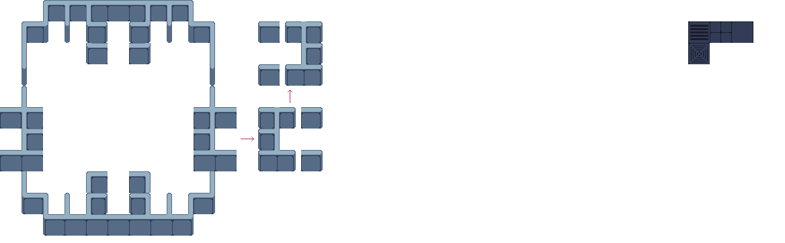

# 그래픽 에셋 임포트
* 폴더 생성

  Assets폴더 밑에 그래픽 에셋들을 관리할 폴더를 하나 생성한다. 이름은 본인이 원하는 걸로 해도 좋지만 할게 없다면은 Sprites나 Grapgics로 하도록 하자.

  그후 생성한 폴더에 필요한 그래픽 에셋들을 넣어준다.
* 한 이미지 파일안에 여러 에셋들이 들어가 있는경우
  
  위의 이미지와 같이 여러 에셋들이 한 이미지 파일안에 들어가 있는 경우들이 있다. 이러한 경우 이미지를 선택해 준뒤 Inspector창에서
  
  
